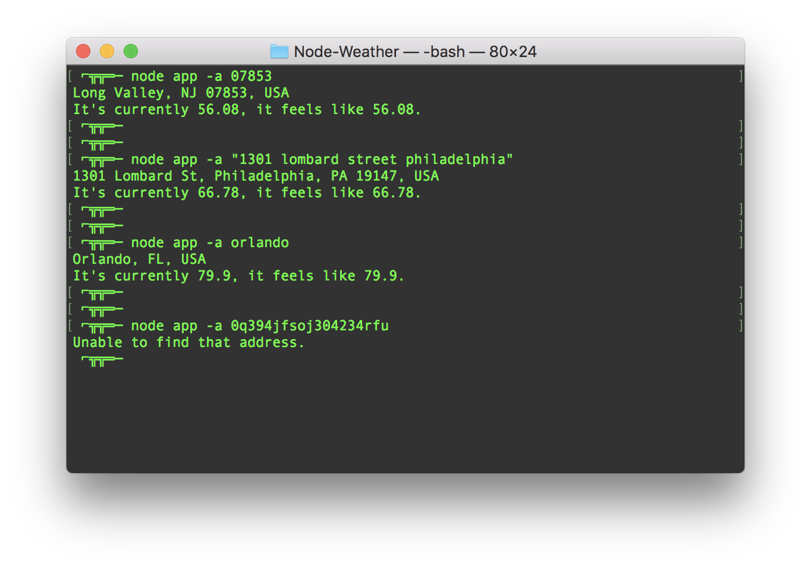

# Node-Weather
Here is a NODE command line weather app. The app uses yargs and axios node packages as well as the Google Maps Geocoding API and the Darksky Forecast API. The user enters an address into the command line where it is encoded and sent to the Google API, then the latitude and longitude are returned and used in the Darksky Forecast API. Once this is completed the full address the user searched and the current weather information is logged to the console.

---

- one

